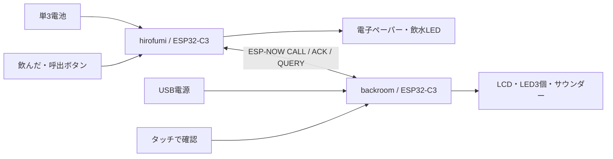

# 要件と設計判断

## 元チャットで決まったこと

- 弘文さん側は乾電池、ESP32-C3、白黒電子ペーパー、触感のある「飲んだ」「呼出」ボタン。
- 待機部屋側はUSB常時給電、ESP32-C3、タッチLCD、LED3個、穏やかな断続音。
- 通信はESP-NOW。想定環境は50m弱・木造壁2枚。実測結果はまだない。
- 音・人感センサーは取りやめ。睡眠推定を行わず時刻で飲水通知を制御する。
- ESP32は下向きピンヘッダでブレッドボードに挿す。操作部は70×30mmユニバーサル基板。
- 最初はアクリル板へアセテートテープで固定し、配置が固まったらネジ止めを検討する。

## 初期実装で具体化した値

| 項目 | 初期値・動作 | 理由・位置づけ |
|---|---|---|
| 飲水間隔 | 「飲んだ」から60分 | 元チャットの方向性。設定で変更可能 |
| 活動時間 | JST 7:00以上21:00未満 | 元チャットの例を暫定値として採用 |
| 朝の動作 | 前の期限を過ぎていたら7:00に通知 | 7:00からさらに60分待つ実装ではない。使用感を確認 |
| 起動・電池交換 | 起動から60分で最初の通知 | 残り時間と呼出の親機状態は電源断で失う |
| 時刻合わせ | 設定があればコールドブート時NTP | Wi-Fi接続最大8秒＋NTP最大4秒。以後APから切断 |
| 時計未設定 | 相対60分のみ、夜間停止なしと表示 | 時刻を推測しない。夜間停止を使う前に時刻同期必須 |
| 呼出再送 | 700msごと、最大5回、同じID | 重複を新規呼出にしない |
| 受信後待受 | 呼出開始から30秒 | 人の確認をしばらく受信できるようにする |
| その後の状態確認 | 60秒ごと、呼出から最大10分 | Deep Sleep中に無線を受信できないため照会する |
| 未確認 | 10分後「届いた・未確認」 | 待機部屋側の通知は止めない |
| ログ | NVSで飲水128件、シリアルCSV出力 | 古いものから上書き。ネットワーク転送は未実装 |
| 画面更新 | 状態変更時。試験用アダプターは全面更新 | 部分更新の波形・残像対策は実機確認後 |

## 電源と表示

LEDはDeep Sleep中もGPIO holdで点灯状態を保持します。
したがって「CPUが寝ているから全体も100µA」とは限りません。
LED1本を1kΩで点灯させれば、Vfを仮に2.0Vとした概算は `(3.3−2.0)/1000 ≈ 1.3mA`。
通知放置時間が長いとLEDが電池消費の主因になります。LEDは最初1kΩで試します。

電子ペーパーには安定化された3.3Vを使い、更新後はhibernateを呼びます。
電池電圧を測る分圧回路は未設計なので、残量表示や低電池検知はまだありません。
基板公称電流は完成品の電池寿命保証ではありません。

## 実装・検証の境界

実機運用の前に、電子ペーパーの現物ドライバー照合、LCD・タッチ動作、
ボタン押下中の電源投入、画面更新中のボタン操作、電池での復帰、現地の通信を確認します。
画面更新は同期処理なので、更新中の短いボタン操作の取りこぼし対策は今後の課題です。

初期実装のESP-NOWは暗号化なしの固定ペア通信です。MAC照合は誤受信対策で、認証ではありません。
暗号化、複数台、中継器、時刻の定期再同期、電池残量、ログ遠隔転送は拡張事項です。
本機だけを緊急時の連絡手段にすることは想定しません。
