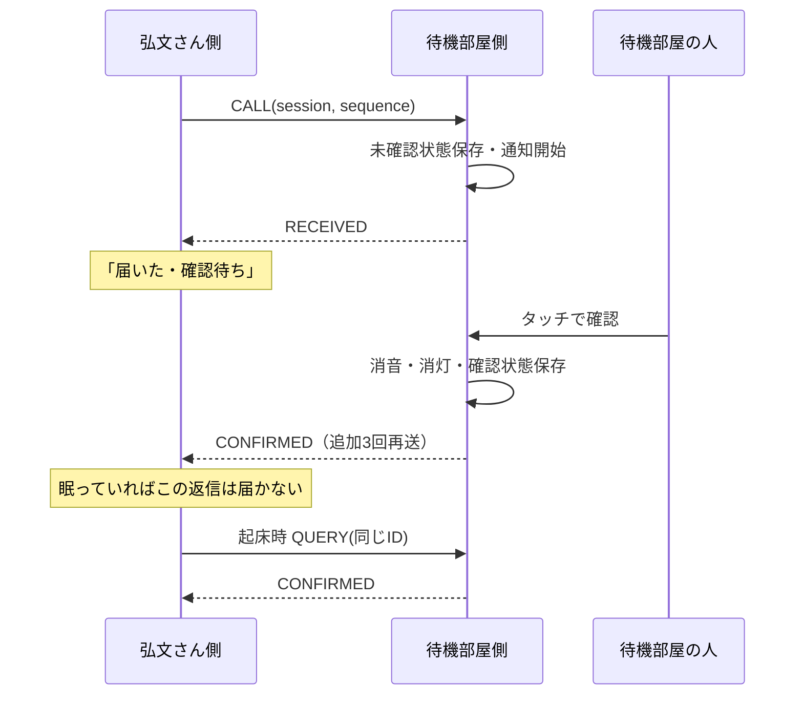

# ESP-NOW通信プロトコル v1

単一の `hirofumi` と単一の `backroom` を固定STA MACで組み合わせます。
相手MAC・チャネルは `secret.h`。AP接続は不要、両機の無線チャネルを一致させます。
Wi-FiによるNTPが終わったらAPを切断してからESP-NOWを開始します。

## フレーム

16バイト固定。ネイティブ構造体のmemcpy送信は使わず、`common/AlertDevice/src/Protocol.h` で変換します。

| オフセット | バイト数 | 内容 |
|---:|---:|---|
| 0 | 2 | マジック：ASCII `HF`（48 46） |
| 2 | 1 | バージョン：1 |
| 3 | 1 | 種別：1 CALL、2 RECEIVED、3 CONFIRMED、4 QUERY |
| 4 | 4 | session：コールドブート時の非ゼロ乱数、LE |
| 8 | 4 | sequence：呼出の連番、1から、LE |
| 12 | 4 | unixTime：呼出時刻UTC秒、未知なら0、LE |

LEはリトルエンディアン。イベントの識別は `送信元MAC + session + sequence`。
応答はCALLの識別子・時刻をそのまま返します。時計の一致を重複排除の条件にしません。
長さ・magic・version・type・ゼロID・相手MACの不一致を破棄します。

## CALL・受信・人の確認

`esp_now_send()` の成功は送信受付であり、相手のアプリ受信成功ではありません。
MAC層送信結果も、人の確認の代用にはしません。必ずアプリ応答を使います。
[Espressif ESP-NOW資料](https://docs.espressif.com/projects/esp-idf/en/v5.5/esp32c3/api-reference/network/esp_now.html)

## 再送とスリープ

- CALLは700ms間隔で最大5回。同じイベントIDを使います。
- RECEIVED到着後はCALL再送を止め、呼出開始から30秒まで起きてCONFIRMEDを待ちます。
- その後は60秒間隔でQUERY。QUERYも最大5回送信します。
- 呼出から10分経過したら自動照会を止め「届いた・未確認」とします。確認失敗を確認成功に変えません。
- CALLに応答がなければ「届いたか不明・再度おす」。待機部屋で鳴っていてACKだけ失われた可能性があります。
- 送信中・届いた・応答不明の状態で呼出を再度押すと、同じIDで送信を再試行します。
- 確認済み・10分経過後の新しい呼出は次の連番になります。

QUERYは状態照会だけで、呼出を新規に開始しません。未知のIDには返信しません。
Deep Sleep中のESP32-C3は無線を受け取れません。「寝たまま確認ACKを受け取る」という動作にはしません。

## 待機部屋側の重複・再起動

最後のCALLと確認フラグを17バイトの単一NVS値に保存します。
同じIDのCALLには現在のRECEIVED/CONFIRMEDを返し、確認済みの音を再開しません。
同じsessionの古いsequenceは無視します。未確認のまま再起動したら通知を再開します。
新しいCALLは現在の呼出を置き換えます（単一利用者の最新呼出だけを保持）。

履歴は最後の1イベントだけです。旧sessionの再送・悪意あるリプレイ・複数送信機の仲裁は対象外。
NVS書き込み失敗はシリアルに表示し、通知処理は継続します。その場合の再起動復元は保証しません。

受信コールバックはWi-Fiタスク上なので、8件のキューにコピーするだけです。
画面・Flash・音・応答送信は `loop()` で処理します。キュー満杯のパケットは破棄し、再送で回復を試みます。

## 拡張時の注意

現在は平文unicastです。MACフィルターは暗号学的認証ではありません。
暗号化PMK/LMKを追加する場合も鍵は `secret.h` に置きます。
互換性を壊すフィールド変更はversionを上げ、フレーム長を曖昧にしないでください。
